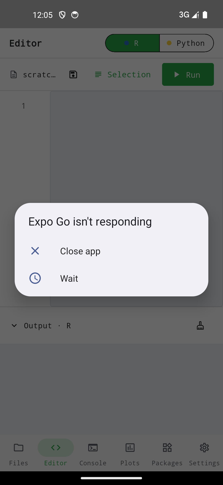

Atelier combine deux runtimes WebAssembly complets sous une interface monospaced unifiée. Tous les modules ci-dessous fonctionnent strictement sur l'appareil.

{width=320}

## Modules

| Onglet | Fonction |
|--------|----------|
| **Editor**   | Éditeur de code monospaced avec coloration syntaxique ; exécution dans le noyau actif. |
| **Console**  | REPL interactive pour le noyau actif (R ou Python). |
| **Files**    | Navigateur du dossier d'espace de travail ; lire, écrire, renommer, partager. |
| **Plots**    | Galerie des graphiques générés ; exportable individuellement en PNG. |
| **Packages** | Gestion des paquets par noyau (R : `webr::install`, Python : `micropip`). |
| **Settings** | Thème (Clair/Sombre/Système), taille de police, chemin d'espace de travail, réinitialisation du noyau. |

## Noyaux et bibliothèques

| Noyau | Runtime | Bibliothèques préinstallées |
|-------|---------|------------------------------|
| **R**      | WebR (R 4.6 en WebAssembly) | base, stats, graphics, methods, utils ; d'autres via `webr::install`. |
| **Python** | Pyodide                     | `numpy`, `pandas`, `scipy`, `matplotlib`, `scikit-learn`. |

Les deux noyaux partagent le même `/workspace` : un fichier écrit en R se lit depuis Python sans conversion.

## Graphiques

Les graphiques de base R (`plot(...)`), ggplot2 (`ggplot(...) + ...`) et matplotlib (`plt.savefig(...)`) sont versés dans la galerie et peuvent être partagés ou enregistrés individuellement au format PNG.

## Garantie hors ligne

Il n'y a aucun accès réseau intégré. Le seul moment où l'application irait chercher des octets sur le réseau est l'installation explicite d'un paquet via `webr::install` ou `micropip` depuis la console — une action utilisateur volontaire.

## Distribution

| Canal | App |
|-------|-----|
| App Store (iOS) · Google Play (Android) | Atelier |
| F-Droid — dépôt propre à Etabli | Atelier (embarque des runtimes WASM précompilés et n'est donc pas dans le dépôt F-Droid principal) |
| Code source | [`etabli-dev/etabli-atelier`](https://github.com/etabli-dev/etabli-atelier) |
